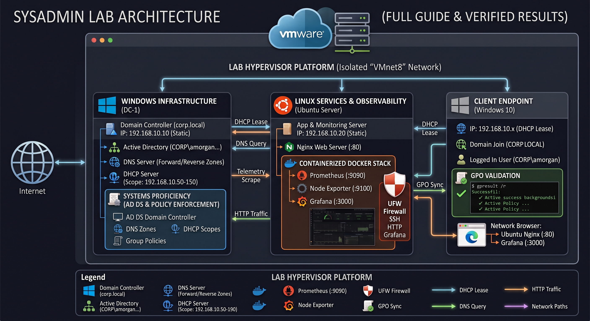
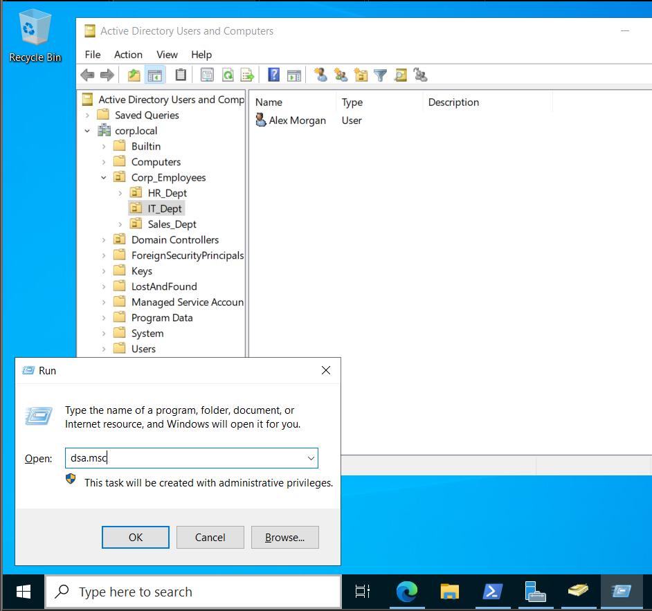
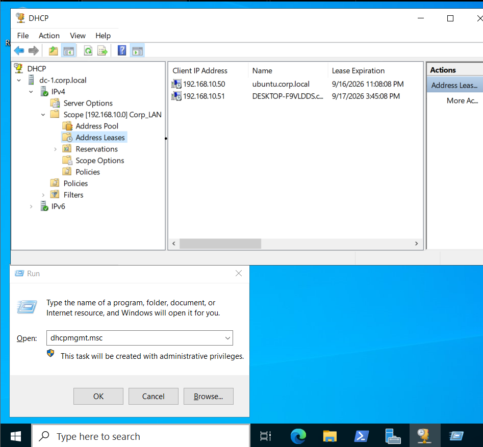
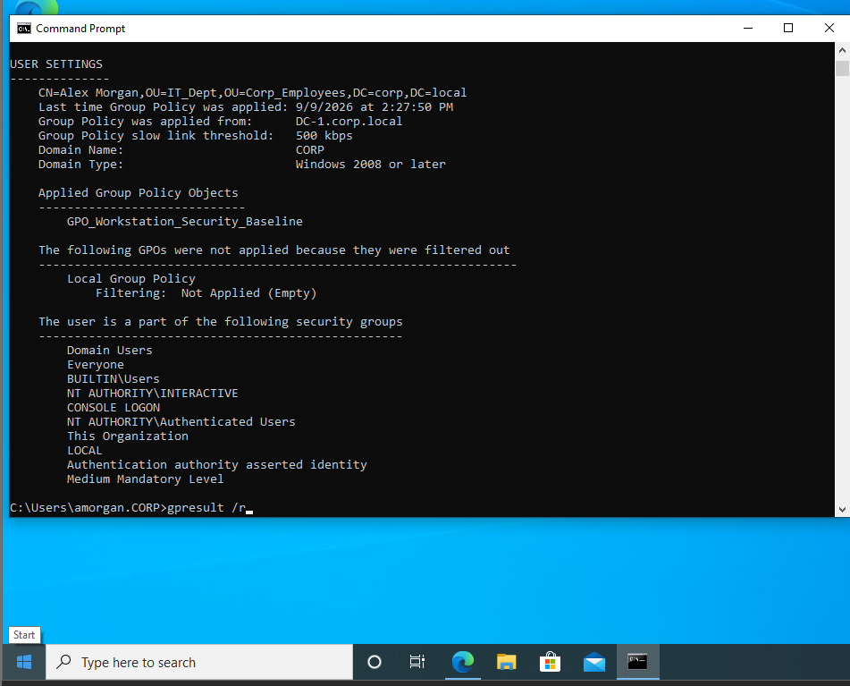
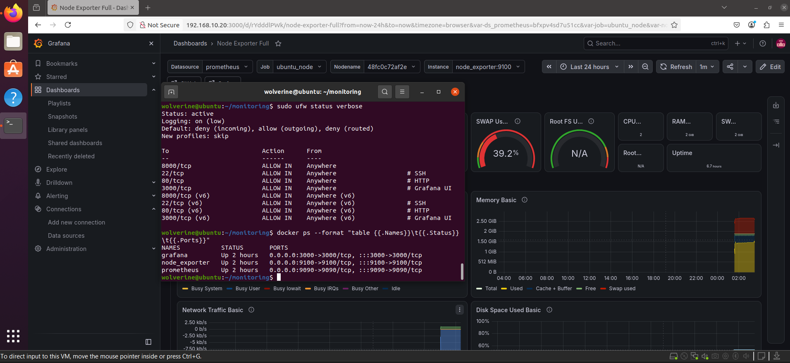
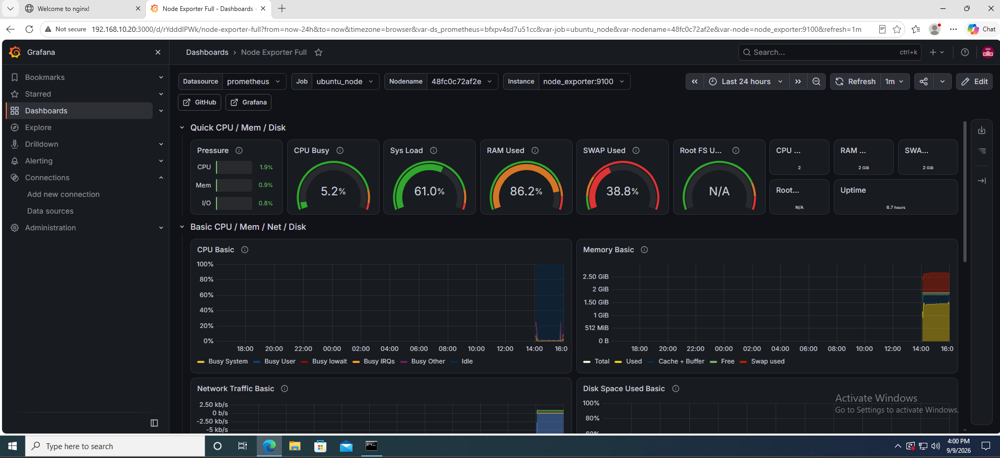

# Enterprise Hybrid Infrastructure & Observability Lab

A production-grade hybrid enterprise lab featuring Windows Server 2022 Active Directory Domain Services (AD DS), centralized DHCP/DNS management, Linux hardening, and containerized telemetry monitoring[cite: 1].

---

## 🏗️ Architecture



* **Isolated NAT Network (`VMnet8`):** `192.168.10.0/24` with Gateway at `192.168.10.2`[cite: 1].
* **DC-1 (`192.168.10.10`):** Windows Server 2022 handling AD DS (`corp.local`), DNS, DHCP scope (`.50`–`.150`), and security GPOs[cite: 1].
* **Ubuntu Server (`192.168.10.20`):** Hardened with UFW, running Nginx (:80) and Docker Compose (Prometheus, Node Exporter, Grafana)[cite: 1].
* **Client Workstation:** Windows 10 Enterprise joined to `corp.local` with enforced security baselines[cite: 1].

---

## 📋 Quick Specs & Command Matrix

| Host / Role | OS | IP Config | Management Command |
| :--- | :--- | :--- | :--- |
| **DC-1** | Windows Server 2022[cite: 1] | `192.168.10.10` (Static)[cite: 1] | `dsa.msc` (AD) / `dhcpmgmt.msc` (DHCP)[cite: 1] |
| **Ubuntu** | Ubuntu 22.04 LTS[cite: 1] | `192.168.10.20` (Static)[cite: 1] | `sudo ufw status` / `docker ps`[cite: 1] |
| **Client** | Windows 10 Enterprise[cite: 1] | Dynamic DHCP[cite: 1] | `whoami` / `gpresult /r`[cite: 1] |

---

## ⚡ Quick Deployment Guide

### Phase 1: Network Setup (VMware VMnet8)
1. In VMware Virtual Network Editor, set **VMnet8 (NAT)** Subnet to `192.168.10.0/24` and Gateway to `192.168.10.2`[cite: 1].
2. **Uncheck** "Use local DHCP service" so the Windows Domain Controller controls all leases[cite: 1].

### Phase 2: Windows Server 2022 Setup (`DC-1`)
1. Assign static IP `192.168.10.10`, subnet `255.255.255.0`, gateway `192.168.10.2`, DNS `127.0.0.1` (`ncpa.cpl`)[cite: 1].
2. Install **AD DS** and **DHCP Server** via Server Manager[cite: 1].
3. Promote server to root domain `corp.local` and reboot[cite: 1].
4. Create DHCP Scope `Corp_LAN` (`192.168.10.50–150`) with Router `192.168.10.2` and DNS `192.168.10.10`[cite: 1]. Authorize the server[cite: 1].
5. Create OU `Corp_Employees` ➔ `IT_Dept` and provision user `amorgan`[cite: 1].
6. Create & link `GPO_Workstation_Security_Baseline` enforcing a 900-second screensaver password lock[cite: 1].

### Phase 3: Ubuntu Hardening & Monitoring
1. Configure static IP via Netplan (`sudo nano /etc/netplan/00-installer-config.yaml`):
```yaml
network:
  version: 2
  ethernets:
    ens33:
      dhcp4: no
      addresses: [192.168.10.20/24]
      routes:
        - to: default
          via: 192.168.10.2
      nameservers:
        addresses: [192.168.10.10, 8.8.8.8]
```
Apply using `sudo netplan apply`[cite: 1].

2. Install Nginx and configure the UFW firewall:
```bash
sudo apt update && sudo apt install nginx docker.io docker-compose-v2 -y
sudo systemctl enable --now nginx
sudo ufw default deny incoming
sudo ufw default allow outgoing
sudo ufw allow 22/tcp && sudo ufw allow 80/tcp && sudo ufw allow 3000/tcp
sudo ufw enable
```

3. Start telemetry stack in `~/monitoring/docker-compose.yml`:
```yaml
services:
  prometheus:
    image: prom/prometheus:latest
    container_name: prometheus
    restart: unless-stopped
    volumes:
      - ./prometheus.yml:/etc/prometheus/prometheus.yml
    ports: ["9090:9090"]

  node_exporter:
    image: prom/node-exporter:latest
    container_name: node_exporter
    restart: unless-stopped
    ports: ["9100:9100"]

  grafana:
    image: grafana/grafana:latest
    container_name: grafana
    restart: unless-stopped
    ports: ["3000:3000"]
    environment:
      - GF_SECURITY_ADMIN_USER=admin
      - GF_SECURITY_ADMIN_PASSWORD=admin
```
Launch with `docker compose up -d`[cite: 1].

### Phase 4: Client Join & Verification
1. Boot Windows 10 with DHCP enabled[cite: 1].
2. Join domain `corp.local` via `sysdm.cpl` using `CORP\Administrator`[cite: 1].
3. Log in as `amorgan`, change the temporary password, and verify GPO enforcement:
```cmd
whoami
gpresult /r
```
4. Access `http://192.168.10.20:3000` to verify live Grafana telemetry across subnets[cite: 1].

---

## 🧪 Proof of Work

### 1. Active Directory OU & User Provisioning


### 2. Centralized DHCP Address Leases


### 3. GPO Baseline Verification (`gpresult /r`)


### 4. Linux Security (UFW) & Docker Containers


### 5. Cross-Subnet Telemetry Dashboard


---

## 📄 Complete Project Documentation & Report

For in-depth theoretical concepts, configuration matrices, and the full step-by-step engineering walkthrough, refer to the complete technical document:

* 📥 **Download Full Lab Report:** [Enterprise-Hybrid-Infra-Lab-Report.pdf](docs/Enterprise-Hybrid-Infra-Lab-Report.pdf)[cite: 1]